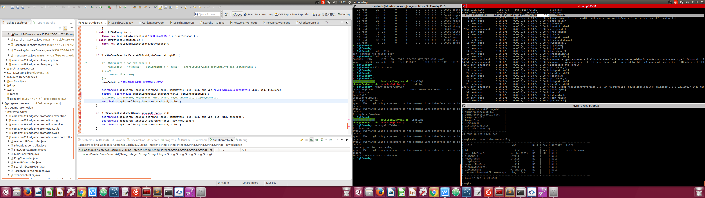

#这是一个测


# 这是一个测试

| 中文的  | 英语的  | 测试功能 |
| ---- | ---- | ---- |
|      |      |      |
|      |      |      |
|      |      |      |

```java
import java.io.*

Void main() {

}
```

如果只是普通的文字呢？





1. URL Ctrl + k

   > [百度的链接](http://baidu.com)

2. 加粗 ctrl + b

   **加粗的信息**

3. 表格 ctrl  + T

   > |      |      |      |
   > | ---- | ---- | ---- |
   > |      |      |      |
   > |      |      |      |
   > |      |      |      |

4.改变字体 ctrl +数字

###### 	达达的字体


>加粗：`Ctrl+B`
>
>斜体：`Ctrl+I`
>
>字体：`Ctrl+数字`
>
>下划线：`Ctrl+U`
>
>返回开头：`Ctrl+Home`
>
>返回结尾：`Ctrl+End`
>
>生成表格：`Ctrl+T`
>
>创建链接：`Ctrl+K`


* ​
* aa
* aaa
* aaa
* aa
* a
* a
* a
* a
* a
* a
* ​


